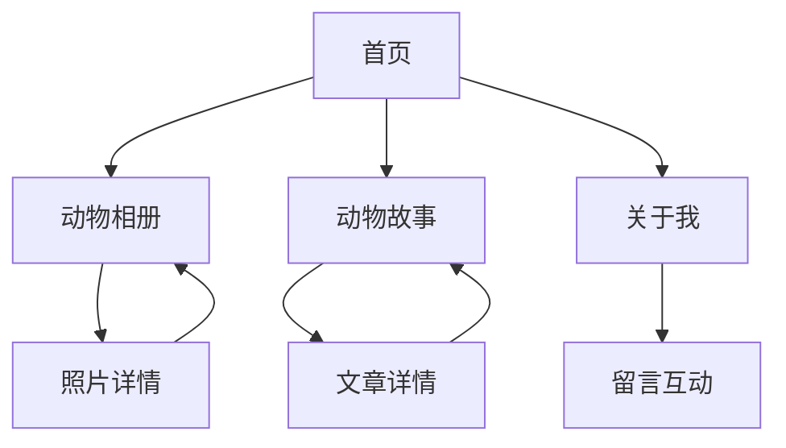

## 1. 产品概述
"我的数字动物寓所" - 一个温馨活泼的动物主题个人网站，展示你对动物的热爱和个性。通过拟人化的动物角色和互动元素，让访客感受到温暖有趣的数字家园氛围。

目标用户：动物爱好者、个人博客读者、寻找创意个人网站灵感的用户。市场价值在于展示个人特色的同时传递对动物的关爱理念。

数据来源：所有数据存储在本地JSON文件中，无需外部数据库或API服务，便于部署和维护。

## 2. 核心功能

### 2.1 用户角色
| 角色 | 注册方式 | 核心权限 |
|------|----------|----------|
| 访客 | 无需注册 | 浏览所有公开内容、留言互动 |
| 管理员 | 后台登录 | 管理所有内容、回复留言、更新个人信息 |

### 2.2 功能模块
网站包含以下核心页面：
1. **首页**：欢迎动画、个人介绍、动物朋友们展示、最新动态。
2. **动物相册**：动物照片集、分类浏览、照片故事、互动点赞。
3. **动物故事**：博客文章、动物趣事分享、访客评论、故事分类。
4. **关于我**：详细介绍、动物理念、联系方式、社交媒体链接。

### 2.3 页面详情
| 页面名称 | 模块名称 | 功能描述 |
|-----------|-------------|---------------------|
| 首页 | 欢迎区域 | 展示动态动物插画和欢迎语，营造温馨第一印象 |
| 首页 | 动物朋友展示 | 轮播展示代表性的动物朋友，每个都有独特个性 |
| 首页 | 最新动态 | 显示最新的动物故事和相册更新 |
| 动物相册 | 相册分类 | 按动物类型或场景分类展示照片集 |
| 动物相册 | 照片详情 | 大图展示、照片故事、点赞收藏功能 |
| 动物故事 | 文章列表 | 博客形式展示动物相关故事和文章 |
| 动物故事 | 文章详情 | 富文本内容、评论区、相关推荐 |
| 关于我 | 个人信息 | 详细介绍、动物保护理念、个人经历 |
| 关于我 | 联系方式 | 邮箱、社交媒体、留言表单 |

## 3. 核心流程
访客浏览流程：
1. 访客进入首页，观看欢迎动画和动物朋友展示
2. 浏览动物相册，查看照片和背后的故事
3. 阅读动物故事，了解动物相关知识和趣事
4. 在关于页面了解站长并留言互动

管理员管理流程：
1. 管理员登录后台
2. 上传新的动物照片和故事
3. 管理访客留言和评论
4. 更新个人信息和网站内容

## 4. 用户界面设计

### 4.1 设计风格
- **主色调**：温暖橙色(#FF8C42)和柔和绿色(#7CB342)，营造自然温馨感
- **辅助色**：米白色(#FFF8E1)和深棕色(#5D4037)用于文字和背景
- **按钮样式**：圆润可爱的动物爪印形状，悬停时有弹性动画
- **字体选择**：主标题用手写体风格，正文用圆润无衬线字体
- **图标风格**：手绘风格的动物图标和植物装饰元素
- **布局风格**：卡片式布局，留白充足，营造轻松阅读体验

### 4.2 页面设计概览
| 页面名称 | 模块名称 | UI元素 |
|-----------|-------------|-------------|
| 首页 | 欢迎区域 | 居中布局的动画动物插画，背景渐变色彩，手写体欢迎语 |
| 首页 | 动物朋友展示 | 圆形头像卡片，悬停时显示动物名字和个性标签 |
| 动物相册 | 相册网格 | 瀑布流布局，照片圆角边框，悬停显示拍摄故事 |
| 动物故事 | 文章卡片 | 左侧图片右侧文字的卡片布局，标签云分类 |
| 关于我 | 个人信息 | 左侧头像右侧文字介绍，背景用树叶纹理装饰 |

### 4.3 响应式设计
- 桌面端优先设计，最大宽度1200px
- 平板端自适应，两栏布局变单栏
- 手机端优化触摸体验，按钮大小适配
- 图片懒加载和渐进式显示

### 4.4 动画效果
- 页面切换使用平滑的淡入淡出效果
- 动物插画有轻微的呼吸动画
- 按钮点击有可爱的动物叫声音效
- 滚动时元素有渐显动画