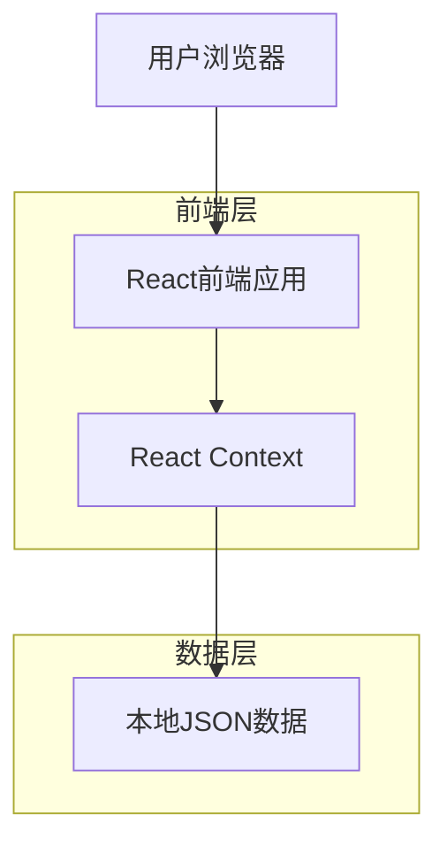

## 1. 架构设计



## 2. 技术描述

- **前端**: React@18 + tailwindcss@3 + vite
- **初始化工具**: vite-init
- **后端**: 无后端，使用本地JSON文件存储数据
- **主要依赖**: 
  - react-router-dom (路由管理)
  - framer-motion (动画效果)
  - lucide-react (图标库)

## 3. 路由定义

| 路由 | 用途 |
|-------|---------|
| / | 首页，展示欢迎动画和动物朋友 |
| /gallery | 动物相册页面，展示分类照片 |
| /gallery/:id | 照片详情页面 |
| /stories | 动物故事列表页面 |
| /stories/:id | 故事详情页面 |
| /about | 关于我页面 |
| /admin | 管理后台登录 |
| /admin/dashboard | 管理后台主页面 |

## 4. 数据管理

### 4.1 本地JSON数据结构

使用本地JSON文件存储所有数据，文件结构如下：

**src/data/animals.json**
```json
{
  "animals": [
    {
      "id": "1",
      "name": "小花",
      "species": "猫咪",
      "personality": "温顺可爱",
      "description": "一只橘白相间的田园猫，喜欢在阳光下打盹",
      "avatar_url": "/images/animals/xiaohua.jpg",
      "created_at": "2024-01-01"
    }
  ],
  "photos": [
    {
      "id": "1",
      "animal_id": "1",
      "title": "午后的慵懒时光",
      "story": "小花在窗台上享受温暖的阳光",
      "image_url": "/images/photos/photo1.jpg",
      "likes_count": 15,
      "created_at": "2024-01-15"
    }
  ],
  "stories": [
    {
      "id": "1",
      "animal_id": "1",
      "title": "小花的日常冒险",
      "content": "今天小花又发现了新的玩耍地点...",
      "cover_image": "/images/stories/story1.jpg",
      "views_count": 32,
      "created_at": "2024-01-20"
    }
  ],
  "comments": [
    {
      "id": "1",
      "story_id": "1",
      "visitor_name": "动物爱好者",
      "content": "小花真可爱！",
      "created_at": "2024-01-21"
    }
  ]
}
```

### 4.2 React Context状态管理

**src/contexts/DataContext.jsx**
```javascript
// 提供全局数据状态管理
const DataContext = createContext();

// 包含所有动物、照片、故事、评论数据
// 提供CRUD操作方法
// 支持数据筛选和搜索功能
```

## 5. 组件架构

### 5.1 核心组件结构
```
src/
├── components/
│   ├── common/
│   │   ├── Header.jsx
│   │   ├── Footer.jsx
│   │   └── AnimalCard.jsx
│   ├── home/
│   │   ├── HeroSection.jsx
│   │   ├── AnimalFriends.jsx
│   │   └── LatestUpdates.jsx
│   ├── gallery/
│   │   ├── PhotoGrid.jsx
│   │   └── PhotoDetail.jsx
│   └── stories/
│       ├── StoryList.jsx
│       └── StoryDetail.jsx
├── pages/
│   ├── Home.jsx
│   ├── Gallery.jsx
│   ├── Stories.jsx
│   └── About.jsx
├── contexts/
│   └── DataContext.jsx
├── hooks/
│   ├── useData.js
│   └── useAnimations.js
└── utils/
    ├── dataStorage.js
    └── animations.js
```

## 6. 性能优化

- 图片使用WebP格式，支持响应式加载
- 实现虚拟滚动优化长列表性能
- 使用React.memo优化组件重渲染
- 本地JSON数据读取优化，使用React.memo缓存
- 实现图片懒加载和渐进式模糊效果